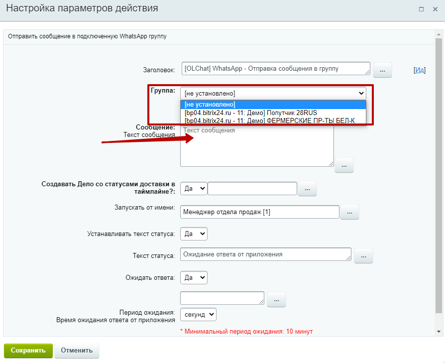
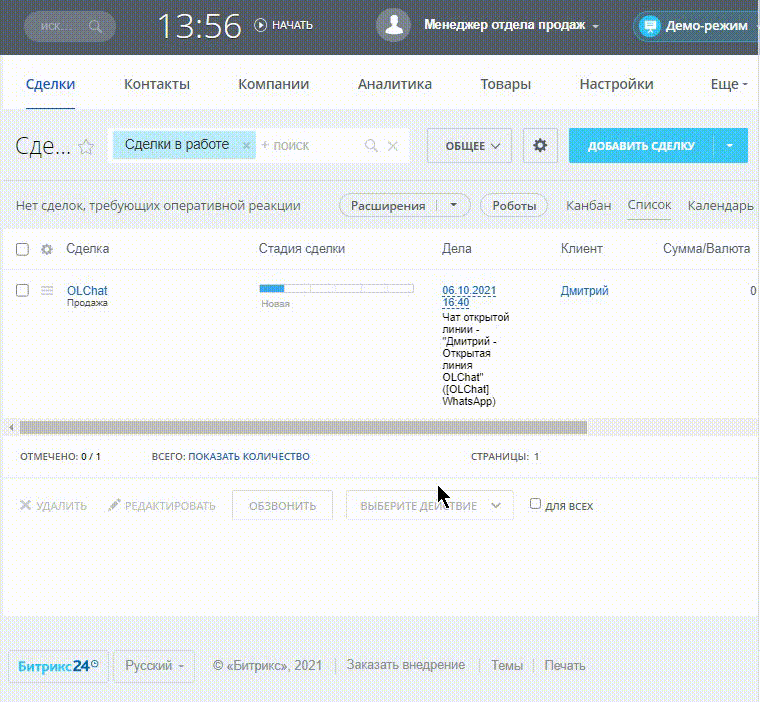

# Отправка сообщения в группу

### Действие (активити) «Отправка сообщения в группу»

Используйте данное активити для отправки сообщений в любую из подключенных групп. Добавьте действие «Отправка сообщения в группу» и выполните его настройку

.png>)

Выберите группу, в которую необходимо отправить сообщение и введите текст

### Робот «Отправка сообщения в группу»

Робот «Отправка сообщения в группу» позволяет создавать автоматизированные сценарии для отправки сообщений в подключенные группы при переходе лида или сделки в определённый статус. Для добавления робота, перейдите в **Роботы**, выберите стадию лида или сделки, при переходе в которую должен сработать робот и добавьте его через меню **Свои роботы — \[OLChat — Чаты и Группы WhatsApp] WhatsApp — Отправка сообщения в группу.** Выполните настройку робота и нажмите на кнопку «СОХРАНИТЬ» в меню робота и в общем окне роботов.

