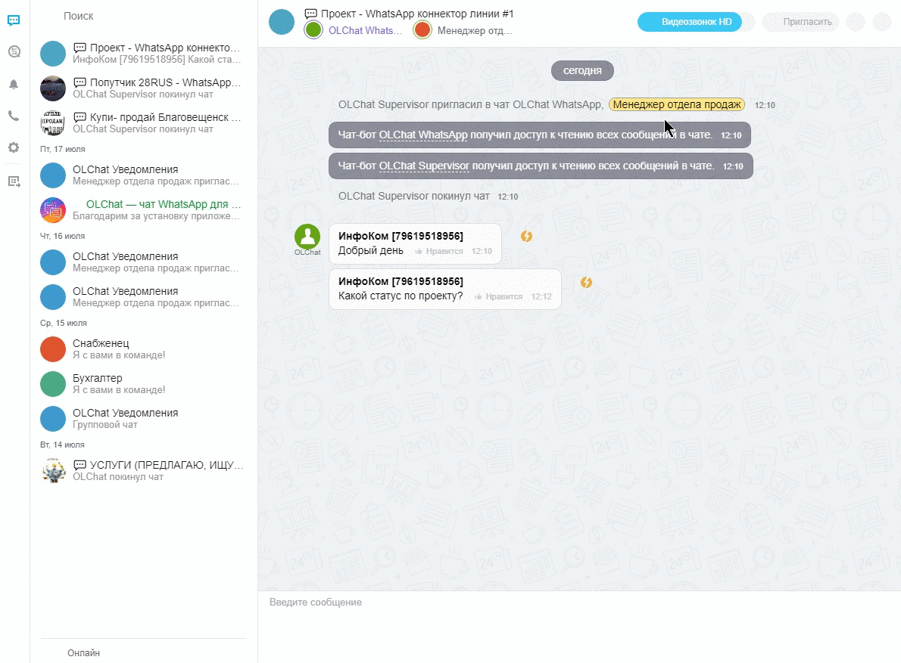

# Сценарии использования групповых чатов WhatsApp в Битрикс24

### Предлагаем два основных сценария использования групповых чатов WhatsApp в Битрикс24:

#### 1. Общение по проекту с клиентом

Вы создаёте групповой чат с клиентом в WhatsApp и подключаете его в Битрикс24. Затем приглашаете в чат нужных сотрудников и ведёте переписку в рамках данного чата прямо из Битрикс24.

#### 2. Мониторинг информации в группах

Как правило, для этих целей подходят группы с объявлениями. При подключении группы вы получаете возможность отправлять в неё сообщения, отслеживать полезную информацию, искать потенциальных клиентов и быстро создавать лиды, сделки, контакты и компании из заинтересовавших вас сообщений. Также в данные группы можно настроить автоматическую отправку сообщений с помощью роботов или бизнес-процессов.

Чтобы создать лид, сделку, контакт или компанию из сообщения, нажмите на значок 🔽 дополнительные действия напротив данного сообщения. Выберите из списка сущность, которую хотите создать. Если сущность с данным номером телефона в CRM не существует — будет создана новая. Текст сообщения добавится в комментарий к созданной сущности. Если в CRM уже имеется сущность с данным номером телефона, система произведёт её поиск и добавит текст сообщения в комментарий.&#x20;
