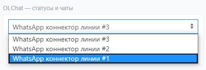

# OLChat — статусы и чаты

Виджет «OLChat — статусы и чаты» информирует о том, на каких номерах клиента установлен WhatsApp, показывает, в каком регионе зарегистрирован номер клиента, предоставляет информацию об операторе и времени клиента. Также виджет обеспечивает быстрый доступ из карточки любой сущности CRM к выбору линии, созданию нового чата, переходу в уже созданный чат, к истории чата и к самому приложению, позволяет отправить сообщение клиенту прямо из карточки CRM не переходя в основное приложение.

<figure><figcaption></figcaption></figure>


Подробнее о том, как включить и показать виджет в карточке ознакомьтесь в статье [#kak-vklyuchit-vidzhety](./#kak-vklyuchit-vidzhety "mention")


### Выбор линии и номера телефона клиента

Если вы подключили несколько коннекторов линий, то вы можете выбрать, с какой именно линии начать диалог с клиентом:

Если у контакта указано несколько номеров телефонов, то все номера на которых установлен WhatsApp отобразятся в виджете списком

<figure><figcaption></figcaption></figure>

### Создание нового диалога и переход в уже созданный чат

Чтобы начать новый диалог с клиентом, выберите нужный номер телефона, на который хотите написать и нажмите на иконку «Создать чат»

<figure><figcaption></figcaption></figure>

Если диалог с клиентом уже начат и чат был создан до этого, вы будете видеть иконку «Открыть чат». После нажатия на неё вы перейдёте в текущий чат с клиентом

<figure><figcaption></figcaption></figure>


Через виджет вы можете открыть чат находясь в любой сущности CRM, даже если он не привязан к текущей сущности


### Отправка сообщений из виджета

Виджет позволяет отправить сообщение клиенту прямо из карточки CRM не переходя в основное приложение. Для этого необходимо нажать на иконку «Написать в чат». В открывшемся поле введите текст сообщения и нажмите на кнопку «Отправить сообщение».

<figure><figcaption></figcaption></figure>

### История чата с клиентом

При клике на иконку «Открыть историю чата» открывается вся доступная для веб-версии WhatsApp переписка, даже если раньше у вас не была подключена интеграция WhatsApp с Битрикс24 или подключена другая интеграция (приложение):

<figure><figcaption></figcaption></figure>

### Переход из виджета в основное приложение

Также через виджет вы можете перейти в приложение и написать сообщение клиенту традиционным способом. Для этого нажмите на иконку «Открыть приложение». В открывшемся приложении введите текст и нажмите на кнопку «Отправить».

<figure><figcaption></figcaption></figure>

### Обновление информации в виджете


Обратите внимание, информация в виджете обновляется до 5 минут.

Для немедленного обновления нажмите на «изменить» чтобы прейти в режим редактирования карточки, нажмите на иконку «Обновить данные виджета» а затем на кнопку «Сохранить»


<figure><figcaption></figcaption></figure>
