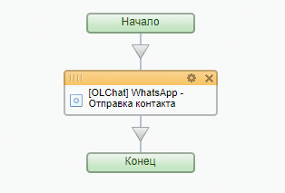

# Отправка контакта

Для отправки контакта из бизнес-процесса добавьте действие «Отправка контакта». Выполните настройку параметров действия:

1. Укажите **Линию WhatsApp,** через которую планируете сделать отправку
2. Введите **Номер телефона**, на который необходимо отправить сообщение
3. Укажите **Номер телефона контакта**
4. Укажите **Фамилию контакта**
5. Укажите **Имя контакта**
6. Укажите **Отчество контакта**
7. Укажите **Название компании контакта**

<figure><figcaption></figcaption></figure>

Активити «Отправка контакта» позволяет сформировать и отправить на выбранный номер карточку контакта, содержащую телефон, ФИО и Название компании, если данные поля были заполнены.

<figure><figcaption></figcaption></figure>

<figure><figcaption></figcaption></figure>
