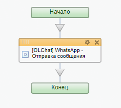

# Отправка сообщения

Для отправки сообщения из бизнес-процесса добавьте действие «Отправка сообщения». Выполните настройку параметров действия:

1. Укажите **Линию WhatsApp,** через которую планируете сделать отправку
2. Введите **Номер телефона**, на который необходимо отправить сообщение
3. Введите текст **Сообщения**

Остальные настройки можно оставить по умолчанию.

<figure><figcaption></figcaption></figure>

Результат работы активити **«\[OLChat] WhatsApp - Отправка сообщения»** можно вывести в уведомления или использовать в условиях для выстраивания различных сценариев автоматизации.

.png>)


Обратите внимание, что переменная **\{{Телефон\}} / \{{Контакт: Телефон\}} / \{{Компания: Телефон\}}** или **\{{Телефон (текст)\}} / \{{Контакт: Телефон (текст)\}} / \{{Компания: Телефон (текст)\}}** собирает и передаёт номера ВСЕХ типов.

**Если в робот передан подобный массив номеров или текстовая строка с номерами и их там несколько – отправка будет осуществлена на первый номер в списке, на котором есть WhatsApp!**



Значение **«Y»**, возвращаемое активити, значит, что сообщение успешно отправлено.

Значение **«N»** или **«E»** может означать несколько вариантов. С более подробным описанием ошибок вы можете ознакомиться в статье [Описание ошибок, возвращаемых роботами и активити бизнес-процессов](../otladka-i-poisk-oshibok/opisanie-oshibok-vozvrashaemykh-robotami-i-aktiviti-biznes-processov.md)

