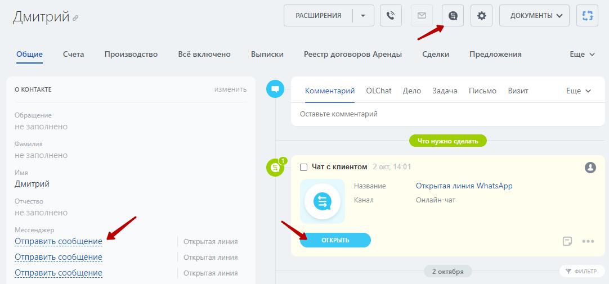

# Роботы


Функционал роботов в лидах и сделках доступен для архивных тарифов Команда, CRM+ и Компания а также в действующих тарифах Базовый, Стандартный, Профессиональный и Энтерпрайз



Общая информация по работе с роботами в Битрикс24:\
[Роботы Битрикс24](https://helpdesk.bitrix24.ru/open/6908975/)


### Установка роботов

Включить роботов можно в настройках приложения: **OLChat — Настройки — Роботы.**

<figure><figcaption></figcaption></figure>

Для установки роботов нажмите на кнопку **«ОБНОВИТЬ РОБОТОВ»**. После нажатия на кнопку вы увидите уведомление об успешной установке роботов а статус возле названия робота поменяет значение с на ✅

<figure><figcaption></figcaption></figure>

### Описание роботов

#### **WhatsApp**

[proverka-telefona.md](proverka-telefona.md "mention") — проверяет телефон на наличие WhatsApp

[sozdanie-chata-ol.md](sozdanie-chata-ol.md "mention") — позволяет создавать чат открытой линии для указанного номера телефона

[ozhidanie-soobsheniya.md](ozhidanie-soobsheniya.md "mention") — позволяет дождаться ответа пользователя на ваше сообщение&#x20;

[otpravka-soobsheniya.md](otpravka-soobsheniya.md "mention") — робот для отправки сообщений

[otpravka-faila.md](otpravka-faila.md "mention") — робот для отправки изображений и других файлов

[otpravka-kontakta.md](otpravka-kontakta.md "mention") — отправляет карточку контакта

[otpravka-ssylki.md](otpravka-ssylki.md "mention") — отправляет ссылку с превью

[otpravka-geometki.md](otpravka-geometki.md "mention") — отправляет местоположение заданное координатами широты и долготы

[otpravka-golosovogo-soobsheniya.md](otpravka-golosovogo-soobsheniya.md "mention") — отправляет аудиосообщение

[otpravka-soobsheniya-s-knopkami.md](otpravka-soobsheniya-s-knopkami.md "mention") — отправляет сообщение с кнопками

[otpravka-soobsheniya-so-spiskom-vybora.md](otpravka-soobsheniya-so-spiskom-vybora.md "mention") — отправляет сообщение со списком выбора

[#robot-upravlenie-gruppoi](../../gruppovye-chaty/robot-i-aktiviti-biznes-processov-dlya-gruppovykh-chatov/upravlenie-gruppoi.md#robot-upravlenie-gruppoi "mention") — робот для управления составом и правами участников группы

#### Роботы групп

Существует отдельный набор роботов с пометкой «\[Группы]» для отправки различного типа сообщений в подключенные группы. Подробнее в статье [robot-i-aktiviti-biznes-processov-dlya-gruppovykh-chatov](../../gruppovye-chaty/robot-i-aktiviti-biznes-processov-dlya-gruppovykh-chatov/ "mention")

#### **OLChat Tools**

[informaciya-o-dialoge.md](informaciya-o-dialoge.md "mention") — позволяет получить подробную информацию о диалоге по одному из типов идентификаторов

[upravlenie-otkrytoi-liniei.md](upravlenie-otkrytoi-liniei.md "mention") — позволяет выполнять действия над открытой линией

[dobavlenie-i-udalenie-uchastnikov-chata.md](dobavlenie-i-udalenie-uchastnikov-chata.md "mention") — позволяет добавить или удалить участников чата

[poluchit-informaciyu-o-chate-iz-whatsapp.md](poluchit-informaciyu-o-chate-iz-whatsapp.md "mention") — позволяет получить подробную информацию о диалоге по номеру телефона
